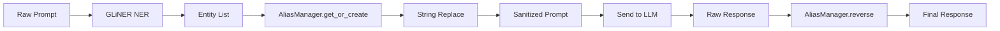

#  Core Logic Blueprint: The Sanitization Engine

> **This is Aayush's domain.** This document explains **exactly** how the Python code works.

---

## The Pipeline (Code Level)



---

## 1. Entity Detection (GLiNER)

### What is GLiNER?
GLiNER is a **zero-shot Named Entity Recognition** model. Unlike SpaCy (which only finds PERSON, ORG, LOC), GLiNER can find **any label you define** without training.

### How We Use It
```python
from gliner import GLiNER

model = GLiNER.from_pretrained("urchade/gliner_medium-v2.1")

labels = [
    "person", "organization", "location", "date",
    "email", "phone number", "project name",
    "product name", "money amount", "medical condition"
]

text = "Tim Cook announced that Apple's Project Titan will launch in Cupertino."

entities = model.predict_entities(text, labels, threshold=0.5)
# Output:
# [
#   {"text": "Tim Cook",       "label": "person",       "score": 0.98},
#   {"text": "Apple",          "label": "organization", "score": 0.97},
#   {"text": "Project Titan",  "label": "project name", "score": 0.91},
#   {"text": "Cupertino",      "label": "location",     "score": 0.95}
# ]
```

### Why GLiNER Over Alternatives

| Tool               | Limitation                                                                           |
| :----------------- | :----------------------------------------------------------------------------------- |
| SpaCy NER          | Fixed labels only. Can't detect "project name" or "product".                         |
| Microsoft Presidio | Heavy. Needs multiple analyzers configured. Overkill for MVP.                        |
| Regex              | Catches emails/phones but misses context ("Apple" the company vs "apple" the fruit). |
| GLiNER             | Zero-shot. Custom labels. Single model. Fast enough for real-time.                   |

---

## 2. The AliasManager (The Brain)

### What It Does
Maintains a **bidirectional dictionary** for the session.

### Implementation
```python
from faker import Faker

fake = Faker()

class AliasManager:
    def __init__(self):
        self.real_to_fake = {}   # {"Apple": "Orion Corp"}
        self.fake_to_real = {}   # {"Orion Corp": "Apple"}
    
    def get_or_create(self, entity_text: str, entity_label: str) -> str:
        """Return existing alias or create a new one."""
        if entity_text in self.real_to_fake:
            return self.real_to_fake[entity_text]
        
        # Generate a contextually appropriate fake
        fake_value = self._generate_fake(entity_label)
        
        self.real_to_fake[entity_text] = fake_value
        self.fake_to_real[fake_value] = entity_text
        return fake_value
    
    def _generate_fake(self, label: str) -> str:
        """Generate a realistic fake based on entity type."""
        generators = {
            "person":       fake.name,
            "organization": fake.company,
            "location":     fake.city,
            "date":         lambda: fake.date_this_year().isoformat(),
            "email":        fake.email,
            "phone number": fake.phone_number,
            "project name": lambda: f"Project {fake.word().capitalize()}",
            "product name": lambda: f"{fake.word().capitalize()}-{fake.random_int(100,999)}",
            "money amount": lambda: f"${fake.random_int(1000, 999999):,}",
        }
        generator = generators.get(label, fake.word)
        return generator()
    
    def sanitize(self, text: str, entities: list) -> str:
        """Replace all real entities with fakes."""
        # Sort by length (longest first) to avoid partial replacements
        sorted_entities = sorted(entities, key=lambda e: len(e["text"]), reverse=True)
        
        sanitized = text
        for entity in sorted_entities:
            alias = self.get_or_create(entity["text"], entity["label"])
            sanitized = sanitized.replace(entity["text"], alias)
        
        return sanitized
    
    def desanitize(self, text: str) -> str:
        """Replace all fakes back with real values."""
        result = text
        # Sort by length (longest first) to avoid partial replacements
        for fake_val, real_val in sorted(
            self.fake_to_real.items(), key=lambda x: len(x[0]), reverse=True
        ):
            result = result.replace(fake_val, real_val)
        return result
```

### The Critical Detail: Sort by Length
If we have `"Apple"` and `"Apple Inc"`, we must replace `"Apple Inc"` **first**.
Otherwise `"Apple"` gets replaced inside `"Apple Inc"` → `"Orion Corp Inc"` (broken).

---

## 3. The Full Sanitizer Pipeline

```python
class Sanitizer:
    def __init__(self):
        self.model = GLiNER.from_pretrained("urchade/gliner_medium-v2.1")
        self.alias_manager = AliasManager()
        self.labels = [
            "person", "organization", "location", "date",
            "email", "phone number", "project name",
            "product name", "money amount"
        ]
    
    def sanitize_prompt(self, user_prompt: str) -> tuple[str, list]:
        """Detect entities, replace them, return sanitized text + entity map."""
        entities = self.model.predict_entities(user_prompt, self.labels, threshold=0.5)
        sanitized = self.alias_manager.sanitize(user_prompt, entities)
        return sanitized, entities
    
    def desanitize_response(self, llm_response: str) -> str:
        """Reverse-map fakes back to real values in the LLM response."""
        return self.alias_manager.desanitize(llm_response)
```

---

## 4. The "Verify" Test (How You Know It Works)

Run this manually before integration:
```python
sanitizer = Sanitizer()

# Test sanitize
prompt = "Tim Cook and Sundar Pichai discussed the Apple-Google deal in Cupertino."
sanitized, entities = sanitizer.sanitize_prompt(prompt)

print(f"Original:  {prompt}")
print(f"Sanitized: {sanitized}")
print(f"Entities:  {entities}")
print(f"Mapping:   {sanitizer.alias_manager.real_to_fake}")

# Test desanitize
fake_response = f"The {sanitizer.alias_manager.real_to_fake.get('Apple', 'X')}-{sanitizer.alias_manager.real_to_fake.get('Google', 'Y')} deal was signed."
restored = sanitizer.desanitize_response(fake_response)

print(f"LLM Said:  {fake_response}")
print(f"Restored:  {restored}")
```

**Expected Output:**
```
Original:  Tim Cook and Sundar Pichai discussed the Apple-Google deal in Cupertino.
Sanitized: James Mitchell and Sarah Chen discussed the Orion Corp-Vega Industries deal in Portland.
Mapping:   {'Tim Cook': 'James Mitchell', 'Sundar Pichai': 'Sarah Chen', ...}
LLM Said:  The Orion Corp-Vega Industries deal was signed.
Restored:  The Apple-Google deal was signed.
```

---

## 5. Edge Cases to Handle

| Edge Case              | Problem                                     | Solution                                                                                       |
| :--------------------- | :------------------------------------------ | :--------------------------------------------------------------------------------------------- |
| **Partial Match**      | "Apple" inside "Appleton"                   | Sort entities longest-first before replacing.                                                  |
| **Case Sensitivity**   | "apple" vs "Apple"                          | Use case-insensitive replace with original casing preserved.                                   |
| **Multi-turn Chat**    | User mentions "Tim Cook" in message 1 and 3 | AliasManager persists across the session (same dict).                                          |
| **Entity in Response** | LLM says "Orion Corp was founded in..."     | `desanitize()` catches it. But hallucinated "history" of Orion Corp stays. Acceptable for MVP. |
| **Numbers/Dates**      | "January 15, 2025" might not be detected    | Add regex fallback for dates, emails, phone numbers.                                           |
