#  Silent-Protocol: Software Requirements Specification (SRS)

**Version:** 1.0
**Project:** Silent-Protocol — The Context-Aware Privacy Proxy
**Team:** Aayush (Lead/ML), Divya (Frontend), Aum (Backend)
**Build Time:** 24 Hours

---

## Table of Contents
1. [Project Overview](#1-project-overview)
2. [System Architecture](#2-system-architecture)
3. [Module Specifications](#3-module-specifications)
4. [API Contracts](#4-api-contracts)
5. [Data Models](#5-data-models)
6. [Frontend Specifications](#6-frontend-specifications)
7. [File Structure](#7-file-structure)
8. [Dependency List](#8-dependency-list)
9. [Environment Variables](#9-environment-variables)
10. [Testing Plan](#10-testing-plan)

---

## 1. Project Overview

### 1.1 What We Are Building
A **privacy proxy** that sits between the user and a public LLM (Groq/OpenAI). It:
1. **Detects** sensitive entities (names, orgs, locations) in the user's prompt
2. **Replaces** them with realistic fakes (consistent per session)
3. **Forwards** the sanitized prompt to the LLM
4. **Reconstructs** the response by swapping fakes back to real values

### 1.2 What We Are NOT Building
-  User authentication / login
-  Database / persistent storage
-  Cloud deployment (localhost only)
-  Multi-user support
-  Payment / billing
-  File upload (text chat only)

---

## 2. System Architecture

### 2.1 High-Level Flow
```
User → [Frontend] → POST /chat → [FastAPI Backend]
                                       -
                                       --- 1. GLiNER (detect entities)
                                       --- 2. AliasManager (replace with fakes)
                                       --- 3. Groq API (get LLM response)
                                       --- 4. AliasManager (reverse fakes)
                                       -
                                  ← JSON Response ← [FastAPI Backend]
                                       -
User ← [Frontend] ← Display response + debug info
```

### 2.2 Component Diagram


### 2.3 Request Lifecycle (Detailed)

```mermaid
sequenceDiagram
    participant U as User (Browser)
    participant F as Frontend (JS)
    participant B as Backend (FastAPI)
    participant S as Sanitizer (GLiNER)
    participant A as AliasManager
    participant L as Groq LLM

    U->>F: Types "Draft NDA for Apple"
    F->>B: POST /chat {message: "Draft NDA for Apple"}
    B->>S: sanitize_prompt("Draft NDA for Apple")
    S->>S: GLiNER detects [Apple → ORG]
    S->>A: get_or_create("Apple", "organization")
    A->>A: Generates "Orion Corp", stores mapping
    S-->>B: Returns {sanitized: "Draft NDA for Orion Corp", entities: [...]}
    B->>L: Send "Draft NDA for Orion Corp"
    L-->>B: "Orion Corp NDA: Party A (Orion Corp)..."
    B->>A: desanitize("Orion Corp NDA...")
    A-->>B: "Apple NDA: Party A (Apple)..."
    B-->>F: {response: "Apple NDA...", sanitized_prompt: "Draft NDA for Orion Corp", entities: [...]}
    F-->>U: Displays response + debug panel
```


---

## 3. Module Specifications

### 3.1 Module: `core/sanitizer.py` (Owner: Aayush)

**Purpose:** Detects entities and orchestrates sanitization/desanitization.

| Method                      | Input | Output              | Description                                         |
| :-------------------------- | :---- | :------------------ | :-------------------------------------------------- |
| `__init__()`                | —     | —                   | Loads GLiNER model, creates AliasManager instance   |
| `sanitize_prompt(text)`     | `str` | `(str, list[dict])` | Returns (sanitized_text, detected_entities)         |
| `desanitize_response(text)` | `str` | `str`               | Reverse-maps all aliases in the response            |
| `get_alias_map()`           | —     | `dict`              | Returns current real→fake mapping (for debug panel) |

**Dependencies:** `gliner`, `alias_manager.py`

**GLiNER Labels to Detect:**
```python
LABELS = [
    "person",
    "organization",
    "location",
    "date",
    "email address",
    "phone number",
    "project name",
    "product name",
    "money amount",
    "medical condition",
    "government id"
]
```

**Detection Threshold:** `0.5` (configurable)

---

### 3.2 Module: `core/alias_manager.py` (Owner: Aayush)

**Purpose:** Maintains bidirectional mapping between real entities and fake aliases.

| Method                       | Input       | Output | Description                                   |
| :--------------------------- | :---------- | :----- | :-------------------------------------------- |
| `__init__()`                 | —           | —      | Creates empty dictionaries                    |
| `get_or_create(text, label)` | `str, str`  | `str`  | Returns existing alias or generates new one   |
| `sanitize(text, entities)`   | `str, list` | `str`  | Replaces all entities in text with aliases    |
| `desanitize(text)`           | `str`       | `str`  | Replaces all aliases back with originals      |
| `get_mapping()`              | —           | `dict` | Returns `{real: fake}` dictionary             |
| `_generate_fake(label)`      | `str`       | `str`  | Uses Faker to generate contextual replacement |

**Faker Mapping Table:**
| Entity Label    | Faker Method                     | Example Output           |
| :-------------- | :------------------------------- | :----------------------- |
| `person`        | `fake.name()`                    | "James Mitchell"         |
| `organization`  | `fake.company()`                 | "Orion Corp"             |
| `location`      | `fake.city()`                    | "Portland"               |
| `date`          | `fake.date_this_year()`          | "2026-03-15"             |
| `email address` | `fake.email()`                   | "j.mitchell@example.com" |
| `phone number`  | `fake.phone_number()`            | "+1-555-0142"            |
| `project name`  | `"Project " + fake.word()`       | "Project Falcon"         |
| `product name`  | `fake.word() + "-" + random_int` | "Nexus-472"              |
| `money amount`  | `"$" + random_int`               | "$127,500"               |

**Critical Rules:**
1. Entities MUST be sorted by length (longest first) before replacement
2. Aliases MUST be consistent within a session
3. `desanitize()` MUST also sort by length (longest fake first)

---

### 3.3 Module: `backend/main.py` (Owner: Aum)

**Purpose:** FastAPI server handling HTTP requests, CORS, and LLM communication.

| Endpoint   | Method | Request Body  | Response Body         | Description             |
| :--------- | :----- | :------------ | :-------------------- | :---------------------- |
| `/chat`    | POST   | `ChatRequest` | `ChatResponse`        | Main chat endpoint      |
| `/health`  | GET    | —             | `{"status": "ok"}`    | Health check            |
| `/aliases` | GET    | —             | `AliasMap`            | Current session aliases |
| `/reset`   | POST   | —             | `{"status": "reset"}` | Clear session aliases   |

**Server Config:**
- Host: `0.0.0.0`
- Port: `8000`
- CORS: Allow all origins (`*`)
- Run command: `uvicorn main:app --reload --port 8000`

**Groq Integration:**
```python
from groq import Groq

client = Groq(api_key=os.getenv("GROQ_API_KEY"))

completion = client.chat.completions.create(
    model="llama-3.1-70b-versatile",
    messages=[{"role": "user", "content": sanitized_prompt}],
    temperature=0.7,
    max_tokens=2048
)

response_text = completion.choices[0].message.content
```

---

### 3.4 Module: `frontend/` (Owner: Divya)

**Files:**
| File         | Purpose                                           |
| :----------- | :------------------------------------------------ |
| `index.html` | Page structure: chat area + debug sidebar         |
| `style.css`  | Dark theme styling, animations                    |
| `script.js`  | Event handlers, fetch API calls, DOM manipulation |

---

## 4. API Contracts

### 4.1 `POST /chat`

**Request:**
```json
{
    "message": "Draft an NDA between Apple Inc and Samsung regarding Project Titan."
}
```

**Response (Success — 200):**
```json
{
    "response": "Draft NDA between Apple Inc and Samsung regarding Project Titan:\n\nThis Non-Disclosure Agreement...",
    "sanitized_prompt": "Draft an NDA between Orion Corp and Vega Industries regarding Project Falcon.",
    "entities_detected": [
        {"text": "Apple Inc", "label": "organization", "alias": "Orion Corp"},
        {"text": "Samsung", "label": "organization", "alias": "Vega Industries"},
        {"text": "Project Titan", "label": "project name", "alias": "Project Falcon"}
    ],
    "silent_mode": true
}
```

**Response (Error — 500):**
```json
{
    "error": "LLM service unavailable",
    "detail": "Groq API returned 503"
}
```

### 4.2 `GET /aliases`

**Response (200):**
```json
{
    "aliases": {
        "Apple Inc": "Orion Corp",
        "Samsung": "Vega Industries",
        "Tim Cook": "James Mitchell",
        "Project Titan": "Project Falcon"
    },
    "total": 4
}
```

### 4.3 `POST /reset`

**Response (200):**
```json
{
    "status": "reset",
    "message": "All aliases cleared"
}
```

### 4.4 `GET /health`

**Response (200):**
```json
{
    "status": "ok",
    "model_loaded": true,
    "groq_connected": true
}
```

---

## 5. Data Models

### 5.1 Pydantic Models (Backend)
```python
from pydantic import BaseModel

class ChatRequest(BaseModel):
    message: str

class EntityInfo(BaseModel):
    text: str        # Original text ("Apple Inc")
    label: str       # Entity type ("organization")
    alias: str       # Fake replacement ("Orion Corp")

class ChatResponse(BaseModel):
    response: str                    # Final response with real names
    sanitized_prompt: str            # What the LLM actually saw
    entities_detected: list[EntityInfo]
    silent_mode: bool

class ErrorResponse(BaseModel):
    error: str
    detail: str
```

### 5.2 In-Memory State
```python
# Session state (lives in memory, dies on server restart)
alias_manager = AliasManager()  # Single instance for the session

# Internal dictionaries:
alias_manager.real_to_fake = {
    "Apple Inc": "Orion Corp",
    "Tim Cook": "James Mitchell"
}
alias_manager.fake_to_real = {
    "Orion Corp": "Apple Inc",
    "James Mitchell": "Tim Cook"
}
```

---

## 6. Frontend Specifications

### 6.1 Page Layout
```
----------------------------------------------------------------
-   Silent-Protocol          [Silent Mode: ON/OFF] [Reset]  -
----------------------------------------------------------------
-                                    -   Debug Panel         -
-  💬 Chat Area                      -                         -
-                                    -  What AI Saw:           -
-  ---------------------------      -  "Draft NDA for         -
-  -  User: Draft NDA for  -      -   Orion Corp..."        -
-  -    Apple and Samsung     -      -                         -
-  ---------------------------      -  Detected Entities:     -
-                                    -  [Apple Inc] → ORG      -
-  ---------------------------      -  [Samsung]   → ORG      -
-  - ⚪ AI: This NDA between  -      -  [Titan]     → PROJECT  -
-  -    Apple Inc ("Party A") -      -                         -
-  -    and Samsung ("Party B")-     -  Alias Map:             -
-  ---------------------------      -  Apple → Orion Corp     -
-                                    -  Samsung → Vega Ind.    -
-  ------------------------  [Send] -                         -
-  - Type your message...  -         -                         -
-  ------------------------         -                         -
----------------------------------------------------------------
```

### 6.2 UI Components

| Component            | HTML Element | CSS Class                               | Behavior                                       |
| :------------------- | :----------- | :-------------------------------------- | :--------------------------------------------- |
| **Header Bar**       | `<header>`   | `.header`                               | Fixed top. Logo + toggle switch + reset button |
| **Chat Area**        | `<main>`     | `.chat-area`                            | Scrollable. Auto-scroll on new message         |
| **User Bubble**      | `<div>`      | `.message.user`                         | Green background, right-aligned                |
| **AI Bubble**        | `<div>`      | `.message.ai`                           | Gray background, left-aligned                  |
| **Input Bar**        | `<form>`     | `.input-bar`                            | Fixed bottom. Text input + Send button         |
| **Debug Panel**      | `<aside>`    | `.debug-panel`                          | Right sidebar. Collapsible                     |
| **Entity Tag**       | `<span>`     | `.entity-tag.person / .org / .location` | Colored pill badges                            |
| **Typing Indicator** | `<div>`      | `.typing-dots`                          | 3 bouncing dots animation                      |

### 6.3 Color Palette (Dark Theme)
```css
:root {
    --bg-primary:    #0a0a0f;     /* Near-black */
    --bg-secondary:  #12121a;     /* Card/panel background */
    --bg-tertiary:   #1a1a2e;     /* Input/hover background */
    --text-primary:  #e0e0e0;     /* Main text */
    --text-secondary:#8888a0;     /* Muted text */
    --accent-green:  #00d26a;     /* User bubbles, active states */
    --accent-purple: #7c3aed;     /* Organization entities */
    --accent-blue:   #3b82f6;     /* Person entities */
    --accent-orange: #f59e0b;     /* Location entities */
    --accent-red:    #ef4444;     /* Errors */
    --border-color:  #2a2a3e;     /* Borders */
}
```

### 6.4 JavaScript Functions

| Function                     | Trigger                       | Action                            |
| :--------------------------- | :---------------------------- | :-------------------------------- |
| `sendMessage()`              | Send button click / Enter key | POST to `/chat`, display response |
| `displayMessage(text, type)` | After API response            | Append bubble to chat area        |
| `updateDebugPanel(data)`     | After API response            | Show sanitized prompt + entities  |
| `toggleSilentMode()`         | Toggle switch                 | Enable/disable sanitization       |
| `resetSession()`             | Reset button                  | POST to `/reset`, clear chat      |
| `showTypingIndicator()`      | While waiting for response    | Show bouncing dots                |
| `hideTypingIndicator()`      | After response received       | Remove bouncing dots              |

### 6.5 Fetch Call (script.js)
```javascript
async function sendMessage() {
    const input = document.getElementById('user-input');
    const message = input.value.trim();
    if (!message) return;

    displayMessage(message, 'user');
    input.value = '';
    showTypingIndicator();

    try {
        const res = await fetch('http://localhost:8000/chat', {
            method: 'POST',
            headers: { 'Content-Type': 'application/json' },
            body: JSON.stringify({ message })
        });
        const data = await res.json();
        hideTypingIndicator();
        displayMessage(data.response, 'ai');
        updateDebugPanel(data);
    } catch (err) {
        hideTypingIndicator();
        displayMessage('Error: Could not reach the server.', 'error');
    }
}
```

---

## 7. File Structure

```
/silent-protocol
-
--- /backend                    ← Aum's domain
-   --- main.py                 # FastAPI app: endpoints, CORS, Groq calls
-   --- requirements.txt        # fastapi, uvicorn, groq, gliner, faker
-   --- .env                    # GROQ_API_KEY=gsk_xxx
-
--- /core                       ← Aayush's domain
-   --- sanitizer.py            # Sanitizer class (GLiNER + AliasManager)
-   --- alias_manager.py        # AliasManager class (Faker + bidirectional dict)
-   --- test_sanitizer.py       # Manual test script
-
--- /frontend                   ← Divya's domain
-   --- index.html              # Page structure
-   --- style.css               # Dark theme, animations
-   --- script.js               # fetch calls, DOM manipulation
-
--- README.md                   # How to run (3 steps)
```

---

## 8. Dependency List

### `requirements.txt`
```
fastapi==0.115.0
uvicorn==0.32.0
groq==0.11.0
gliner==0.2.7
faker==30.0.0
python-dotenv==1.0.1
```

### Frontend
- No dependencies. Vanilla HTML/CSS/JS only.
- Use VS Code "Live Server" extension for preview.

---

## 9. Environment Variables

| Variable       | Value                  | Where           |
| :------------- | :--------------------- | :-------------- |
| `GROQ_API_KEY` | `gsk_xxxxxxxxxxxxxxxx` | `/backend/.env` |

**How to get it:**
1. Go to https://console.groq.com
2. Sign up (free)
3. Create an API key
4. Save in `.env` file

---

## 10. Testing Plan

### 10.1 Unit Tests (Aayush)
| Test              | Input                                      | Expected Output                                                                 | Pass Criteria                  |
| :---------------- | :----------------------------------------- | :------------------------------------------------------------------------------ | :----------------------------- |
| Entity Detection  | "Tim Cook works at Apple"                  | `[{text: "Tim Cook", label: "person"}, {text: "Apple", label: "organization"}]` | Both entities detected         |
| Alias Creation    | `get_or_create("Apple", "organization")`   | Returns a fake company name                                                     | Non-empty string, not "Apple"  |
| Alias Consistency | Call `get_or_create("Apple", "org")` twice | Same alias both times                                                           | `result1 == result2`           |
| Sanitize          | "Apple bought Samsung"                     | "Orion Corp bought Vega Industries"                                             | No real names in output        |
| Desanitize        | "Orion Corp bought..."                     | "Apple bought..."                                                               | All fakes replaced with real   |
| Sort-by-Length    | Text contains "Apple" and "Apple Inc"      | "Apple Inc" replaced first                                                      | No broken partial replacements |

### 10.2 Integration Tests (All)
| Test            | Steps                                                            | Expected                     |
| :-------------- | :--------------------------------------------------------------- | :--------------------------- |
| **End-to-end**  | Type "Hello" in UI → get response                                | AI responds, no crash        |
| **Privacy**     | Type "Tim Cook at Apple" → check sanitized_prompt in debug panel | Debug panel shows fake names |
| **Consistency** | Send 3 messages mentioning "Apple"                               | Same alias used all 3 times  |
| **Reset**       | Click Reset → send message with "Apple"                          | New alias generated          |

### 10.3 Demo Script (The "Hero Prompt")
```
Step 1: Type: "Draft an NDA between Apple Inc and Samsung Electronics 
        regarding Project Titan battery technology. Tim Cook and 
        JY Lee will sign the agreement in Cupertino, California."

Step 2: Show Debug Panel: "All names replaced with fakes"

Step 3: Show AI Response: "Perfect NDA with REAL names restored"

Step 4: Type: "Add a clause about Apple's liability"
        → Show: Same alias "Orion Corp" used (consistency!)
```
