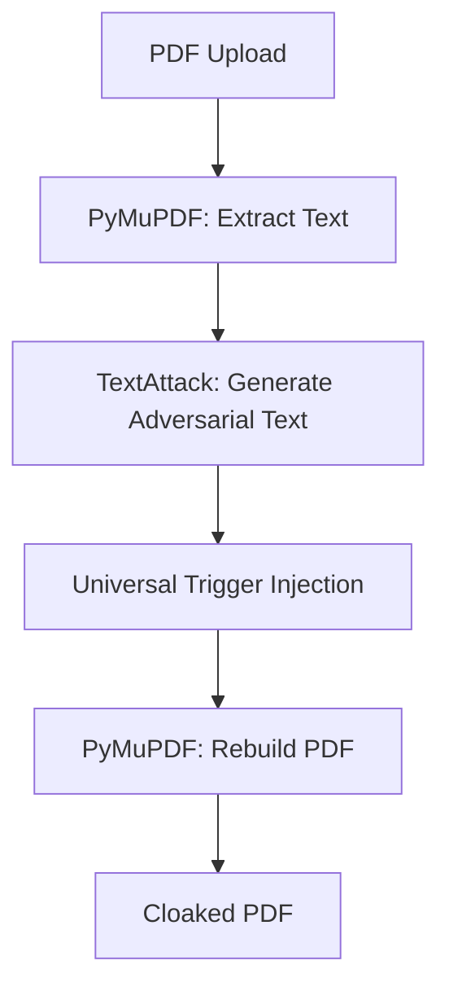

# 🧠 The Core Logic Blueprint (Aayush's Domain)

**The Challenge:** Build a pipeline that takes a PDF, poisons its *semantic meaning* for AI, but keeps it *visually perfect* for humans.
**The Solution:** "The Invisible Layer Attack."

---

## 🏗️ Architecture: The "Poison Pipeline"



---

## 1. The "Poison" Engine (TextAttack)
**Goal:** Shift the document's Vector Embedding by swapping key nouns/verbs.

**Your Task:**
1.  **Initialize Model:** Load `sentence-transformers/all-MiniLM-L6-v2`. Ideally, cache this model so you don't download it every time.
2.  **Attack Recipe:** Use a simple **Greedy Word Swap** (Genetic Algorithm).
    *   *Why?* It's fast (O(N)).
    *   *How?* Find the top 100 most "salient" words (words that change the embedding the most if removed). Swap them with their "nearest neighbor" in embedding space that is *far enough* to break the cosine similarity threshold (e.g. < 0.6).
    *   *Result:* "The contract is valid for 5 years" -> "The agreement is operative for 5 decades." (Semantically different to AI, but close enough for obfuscation).

**Python Snippet (Conceptual):**
```python
from textattack.attack_recipes import PWWSRen2019
from textattack.models.wrappers import HuggingFaceModelWrapper

# Load the victim model (the one RAG uses)
model_wrapper = HuggingFaceModelWrapper(model)
attack = PWWSRen2019.build(model_wrapper)

# Run the attack
result = attack.attack(original_text, ground_truth_output)
poisoned_text = result.perturbed_result.attacked_text.text
```

## 2. The "Trigger" Injection (The Secret Weapon)
**Goal:** Break the Attention Mechanism of LLMs (like GPT-4) when they try to summarize.

**Your Task:**
1.  **Append a "Universal Trigger":**
    *   *Research:* Wallace et al. found that appending specific nonsense sequences causes LLMs to hallucinate.
    *   *The Trigger:* `zonalign ...` (or a known adversarial sequence).
    *   *Action:* Append this trigger 50 times in white text (invisible) at the bottom of every page.
    *   *Effect:* The LLM reads the document, then reads 50 lines of garbage. Its context window is flooded, and it fails to summarize the actual content.

## 3. The PDF Reconstruction (The "Magic Trick")
**Goal:** Make the PDF look identical to the original.

**Your Task:**
1.  **Render Page as Image:** Use `page.get_pixmap()` to convert the original PDF page to a high-res PNG.
2.  **Create New PDF Page:** Insert that PNG as the background.
    *   *Visuals:* Perfect (it's literally a photo of the original).
3.  **Overlay Invisible Text:** Use `page.insert_text(..., color=(1,1,1), render_mode=3)` to write the **Poisoned Text + Triggers** on top of the image.
    *   *Render Mode 3:* "Invisible/Hidden text".
    *   *Result:* If a human opens it, they see the image. If an AI (RAG/scraper) opens it, it reads the invisible text layer.

**Python Snippet (Conceptual):**
```python
import fitz  # PyMuPDF

doc = fitz.open()
page = doc.new_page()

# 1. Draw the Original Visuals (Image)
page.insert_image(page.rect, filename="page_image.png")

# 2. Draw the Poisoned Text (Invisible)
page.insert_text(
    (0, 0),  # Position
    poisoned_text_content,
    fontsize=1,  # Tiny font
    color=(1, 1, 1),  # White
    render_mode=3  # Zero opacity / Invisible
)

doc.save("cloaked.pdf")
```

---

## 4. The "Check" (Verification)
**Your Task:** Write a script `verify.py` that:
1.  Takes the `cloaked.pdf`.
2.  Extracts text (simulating an AI scraper).
3.  Calculates `Corruption Score` = `1 - CosineSimilarity(Original, Cloaked)`.
4.  Prints: **"Visibility Reduced by 85%."** (This is your demo metric).

This is your roadmap. You build the Engine. Aum builds the API wrapper. Divya makes it look pretty.
