# High-Impact Hackathon Project Ideas — First-Principles Analysis

> Derived from real, present-day pain points. Each idea follows a strict **Pain → Insight → Solution** mapping.

---

## 🏆 Project 1: **FraudShield** — Real-Time UPI Transaction Fraud Intelligence

### Pillar: **Fintech & Economy**

### The Pain Point

India's UPI ecosystem processed **16.6 billion transactions/month** in 2025, yet **13+ lakh fraud cases** were reported in FY 2024-25 alone. Current fraud detection systems operate on rule-based heuristics that are brittle, generate high false-positive rates (blocking legitimate users), and cannot adapt to novel attack patterns like SIM-swap chains, QR code poisoning, and social engineering at scale.

**Why it exists:** UPI was designed for frictionless payments — speed was prioritized over security layering. Traditional banks bolt on fraud checks as an afterthought, leading to a reactive posture.

**Why it remains unsolved:** Real-time fraud detection at UPI's scale (500+ TPS) requires sub-100ms inference — most ML models are too slow or too inaccurate. Cross-bank data sharing for fraud patterns is hindered by data sovereignty concerns and competitive dynamics between banks.

**Why it matters now:** UPI fraud is growing **300% YoY**. The RBI's 2025 Digital Lending Directions mandate stronger borrower protections. Authorized Push Payment (APP) fraud is *irrevocable* — once money leaves, there's no reversal mechanism.

### The Insight

Fraud patterns are **temporal-graph problems**, not tabular classification problems. A fraudster's behavior unfolds as a sequence of micro-events across accounts, devices, and networks. Graph Neural Networks (GNNs) operating on transaction graphs can detect anomalous subgraph patterns in real-time that flat ML models cannot.

### The Solution

A **real-time transaction graph analysis engine** that:
1. Constructs a dynamic transaction graph per user (nodes = accounts, edges = transactions, device links, geo-hops)
2. Runs lightweight GNN inference (<50ms) to score each transaction's fraud probability
3. Uses federated learning so banks can collaboratively train models *without* sharing raw data
4. Provides an explainable risk dashboard showing *why* a transaction was flagged (graph path visualization)

### Why Judges Would Select This

| Criteria                  | Score (/10) | Justification                                                                           |
| ------------------------- | :---------: | --------------------------------------------------------------------------------------- |
| **Novelty**               |      9      | GNN-based fraud detection on UPI transaction graphs is unexplored in hackathon settings |
| **Real-world relevance**  |     10      | Directly addresses a ₹10,000 Cr+ annual fraud problem                                   |
| **Scalability**           |      8      | Federated approach scales across all UPI-participating banks                            |
| **Measurable impact**     |      9      | Can demonstrate false-positive reduction and fraud-catch rate on synthetic datasets     |
| **Hackathon feasibility** |      7      | Graph construction + lightweight GNN demo is achievable in 36-48 hrs                    |
| **Win likelihood**        | **8.5/10**  |                                                                                         |

---

## 🏆 Project 2: **CreditBridge** — AI-Powered MSME Credit Scoring Without Financial History

### Pillar: **Fintech & Economy**

### The Pain Point

India's 63 million MSMEs face a **₹20-25 lakh crore credit gap** — nearly 50% of credit demand goes unmet. Micro-enterprises (99% of all MSMEs) are systematically excluded from formal credit because they lack collateral, audited financial statements, and credit bureau history. Traditional credit scoring models (CIBIL) are designed for salaried individuals and large enterprises, making them structurally blind to the informal economy.

**Why it exists:** Banks use backward-looking, document-heavy underwriting built for a formal economy. India's informal sector generates wealth through cash flow, not balance sheets.

**Why it remains unsolved:** Alternative data scoring exists conceptually but nobody has cracked the *input pipeline problem* — collecting, normalizing, and scoring heterogeneous signals (GST filings, UPI transaction velocity, utility payments, supply chain invoices) in a privacy-preserving manner.

**Why it matters now:** The RBI's Account Aggregator (AA) framework is live, unlocking consent-based data sharing. ONDC is generating verifiable commerce data for small merchants. The window to build on this infra is *right now*.

### The Insight

An MSME's creditworthiness is encoded in its **cash-flow graph**, not its balance sheet. By constructing a real-time cash-flow profile from AA-consented data + GST returns + UPI merchant transaction patterns, you can build a "living credit score" that updates daily — turning a binary approve/reject model into a dynamic credit line.

### The Solution

A **consent-based alternative credit scoring platform** that:
1. Pulls financial data via India's **Account Aggregator** APIs (bank statements, GST, utility bills)
2. Builds a multi-dimensional cash-flow health score using time-series analysis + NLP on invoice descriptions
3. Generates an MSME "CreditPassport" — a portable, verifiable credit profile that any lender can consume
4. Uses on-device privacy-preserving computation so raw financial data never leaves the user's phone

### Why Judges Would Select This

| Criteria                  | Score (/10) | Justification                                                                       |
| ------------------------- | :---------: | ----------------------------------------------------------------------------------- |
| **Novelty**               |      9      | Cash-flow-graph-based scoring on AA infra is cutting-edge and India-specific        |
| **Real-world relevance**  |     10      | Addresses the single largest economic bottleneck for India's GDP growth             |
| **Scalability**           |      9      | AA framework provides a national-scale data pipe; CreditPassport is lender-agnostic |
| **Measurable impact**     |      9      | Can quantify: % of previously "unscorable" MSMEs now receiving a score              |
| **Hackathon feasibility** |      7      | AA sandbox APIs available; can demo with synthetic merchant profiles                |
| **Win likelihood**        |  **9/10**   |                                                                                     |

---

## 🏆 Project 3: **RegLens** — GenAI Regulatory Compliance Autopilot

### Pillar: **Generative AI**

### The Pain Point

Financial institutions, healthcare providers, and enterprises spend **$180B+ globally** on compliance annually. Compliance teams manually read 300+ page regulatory documents (RBI circulars, EU AI Act, GDPR amendments), extract obligations, cross-reference them against internal policies, and track changes across jurisdictions. A single missed clause can result in multi-million dollar fines. The average compliance officer spends **60% of their time** on document parsing — not on strategic risk management.

**Why it exists:** Regulations are written in dense legal prose with cross-references, nested exceptions, and jurisdiction-specific nuances. Traditional keyword search and rule-based NLP fail catastrophically on this structure.

**Why it remains unsolved:** Generic LLMs hallucinate legal obligations. Enterprise RAG systems struggle because compliance documents are deeply hierarchical (sections → sub-sections → provisos → schedules) and require *relational reasoning* across documents, not just retrieval.

**Why it matters now:** The regulatory surface area is exploding — EU AI Act (Aug 2025 enforcement), India's DPDP Act, RBI's 2025 Digital Lending Directions. Companies are drowning.

### The Insight

Compliance is not a search problem — it's a **structured reasoning problem over a knowledge graph of obligations**. By converting regulatory documents into a typed knowledge graph (Entity: Obligation, Condition, Exception, Deadline, Penalty), an LLM can perform *compositional reasoning* over obligations rather than just retrieving passages.

### The Solution

A **regulatory knowledge graph + LLM reasoning engine** that:
1. Ingests regulatory PDFs and converts them into a structured **obligation graph** using fine-tuned document understanding models
2. Allows natural-language querying: *"What are my data retention obligations if I process health data of EU citizens?"*
3. Auto-generates a **compliance checklist** mapped to internal policy documents with gap analysis
4. Monitors regulatory feeds (gazette notifications, circulars) and **alerts** when new obligations affect the organization
5. Provides citation-grounded answers — every output links back to the exact clause, page, and document

### Why Judges Would Select This

| Criteria                  | Score (/10) | Justification                                                                  |
| ------------------------- | :---------: | ------------------------------------------------------------------------------ |
| **Novelty**               |      9      | Knowledge-graph-backed LLM reasoning over regulations is architecturally novel |
| **Real-world relevance**  |     10      | Every regulated industry needs this — from banks to hospitals                  |
| **Scalability**           |      9      | Once the graph schema is built, adding new regulation PDFs is incremental      |
| **Measurable impact**     |      9      | Demo: 10x faster obligation extraction vs. manual review                       |
| **Hackathon feasibility** |      8      | Can demo with 2-3 real RBI circulars + a small knowledge graph                 |
| **Win likelihood**        |  **9/10**   |                                                                                |

---

## 🏆 Project 4: **EduForge** — Adaptive Exam Prep with GenAI Knowledge-Gap Detection

### Pillar: **Generative AI**

### The Pain Point

250+ million Indian students prepare for competitive exams (JEE, NEET, UPSC, SSC) annually. Despite the $8B+ edtech market, **no platform actually diagnoses *why* a student gets a question wrong**. Current platforms bucket errors as "incorrect" without distinguishing between a conceptual misunderstanding, a calculation error, a time-management failure, or a trick-question trap. Students end up solving thousands of questions without targeted improvement — like practicing archery blindfolded.

**Why it exists:** Building genuine diagnostic assessment requires deep domain modeling of *prerequisite concept dependencies* (e.g., you can't solve projectile motion without understanding vector decomposition). EdTech companies optimized for engagement metrics (time-on-app), not learning outcomes.

**Why it remains unsolved:** Taxonomy-level concept mapping is expensive to build manually. Auto-generating it from question banks requires understanding both the *solution path* and the *failure modes* of each question — something pre-LLM NLP couldn't do.

**Why it matters now:** GPT-4/Gemini-class models can now reliably parse multi-step STEM solutions. India's NEP 2020 mandates competency-based learning. The first platform that cracks concept-level diagnostics wins the entire test-prep market.

### The Insight

Every wrong answer encodes a **specific failure mode** on a **specific prerequisite in the concept dependency graph**. By mapping questions to a concept DAG and using LLMs to analyze *submitted solutions* (not just final answers), you can pinpoint the exact conceptual gap and generate targeted remediation.

### The Solution

An **AI-powered diagnostic learning platform** that:
1. Maintains a **concept dependency graph** per subject (auto-generated + expert-curated)
2. When a student submits an answer, the LLM analyzes the *solution process* to classify the error type
3. Maps the error to the specific **prerequisite concept** that needs reinforcement
4. Generates **personalized micro-lessons** and practice problems targeting that exact gap
5. Tracks concept mastery over time as a visual "skill tree" the student can navigate

### Why Judges Would Select This

| Criteria                  | Score (/10) | Justification                                                                 |
| ------------------------- | :---------: | ----------------------------------------------------------------------------- |
| **Novelty**               |      9      | Error taxonomy + concept DAG + LLM solution analysis is a unique architecture |
| **Real-world relevance**  |     10      | 250M+ students, ₹60,000 Cr test-prep market in India alone                    |
| **Scalability**           |      8      | Concept graph is reusable; works across subjects and exam types               |
| **Measurable impact**     |      9      | A/B testable: track concept mastery velocity vs. baseline                     |
| **Hackathon feasibility** |      8      | Demo with one subject (Physics Ch 1-5), 50 questions, 10-node concept graph   |
| **Win likelihood**        | **8.5/10**  |                                                                               |

---

## 🏆 Project 5: **TruthLens** — Real-Time Multimodal Misinformation Detection Engine

### Pillar: **Open Innovation**

### The Pain Point

Social media platforms process **500M+ posts/day** in India alone. During elections, communal tensions, or health crises, misinformation spreads **6x faster** than factual content. Existing fact-checking is *manual* — organizations like BOOM and AltNews review ~200 claims/day, a drop in the ocean. Deepfake videos, AI-generated images, and out-of-context media are now indistinguishable from real content to the average user.

**Why it exists:** Content moderation was designed for text keywords. Multimodal misinformation (manipulated images, out-of-context videos, AI-generated audio) defeats text-only classifiers. Platforms lack incentive to aggressively moderate because engagement = revenue.

**Why it remains unsolved:** Multimodal verification requires cross-referencing claims against *structured knowledge bases*, reverse-image-searching for originals, analyzing audio spectrograms for deepfake artifacts, and understanding temporal context — no single model does all of this.

**Why it matters now:** 2025-26 sees elections in multiple Indian states. AI-generated deepfakes of politicians are already circulating. The Information Technology (Intermediary Guidelines) Rules mandate platforms to identify first originators of viral misinformation — but no tool exists to automate this at scale.

### The Insight

Misinformation is a **multi-signal problem requiring ensemble verification**. The key is building a **claim decomposition pipeline**: break a viral post into atomic claims (text assertions, image provenance, video timeline, audio authenticity), verify each independently against knowledge bases and reverse-search indices, and aggregate into a confidence score.

### The Solution

A **multimodal misinformation detection pipeline** that:
1. **Ingests** viral content (text + image + video + audio) from social media APIs
2. **Decomposes** the content into verifiable atomic claims using an LLM
3. **Verifies** each claim component independently:
   - Text claims → Cross-referenced against news API knowledge base + Wikidata
   - Images → Reverse image search + forgery detection (ELA, noise analysis)
   - Video → Deepfake detection (face inconsistency, lip-sync mismatch)
   - Audio → Spectrogram analysis for synthetic speech markers
4. **Aggregates** verification scores into an overall trust rating with human-readable explanations
5. **Delivers** results via a browser extension, WhatsApp bot, or journalist dashboard

### Why Judges Would Select This

| Criteria                  | Score (/10) | Justification                                                                    |
| ------------------------- | :---------: | -------------------------------------------------------------------------------- |
| **Novelty**               |      9      | Multimodal claim-decomposition + ensemble verification is architecturally unique |
| **Real-world relevance**  |     10      | Democratic integrity, public health, communal harmony                            |
| **Scalability**           |      8      | Pipeline is modular — new verification modules can be plugged in                 |
| **Measurable impact**     |      9      | Benchmark against known misinformation datasets (LIAR, FakeCovid)                |
| **Hackathon feasibility** |      7      | Demo with text + image verification; video/audio as stretch goals                |
| **Win likelihood**        | **8.5/10**  |                                                                                  |

---

## 🏆 Project 6: **GreenLedger** — Carbon Credit Tokenization & Verification Platform

### Pillar: **Open Innovation**

### The Pain Point

The voluntary carbon credit market hit **$2B in 2024** but is plagued by fraud — **over 90% of rainforest offset credits** have been found to be "phantom credits" with no real climate impact (per The Guardian investigation). Buyers cannot independently verify if a credit represents real carbon sequestration. Double-counting (the same reduction sold to multiple buyers) is rampant. Small-scale projects (farmers, community forests) are excluded because verification costs ($50K-$100K per audit) are prohibitive.

**Why it exists:** Carbon credit verification relies on manual, periodic audits by certification bodies (Verra, Gold Standard). These audits are expensive, infrequent, and susceptible to gaming. There's no continuous monitoring or immutable registry of credit provenance.

**Why it remains unsolved:** Connecting physical-world carbon sequestration data (satellite imagery, soil sensors, biomass measurements) to financial-world credit issuance requires bridging domains that currently don't talk to each other. Blockchain solutions exist but lack the oracle layer for real-world verification.

**Why it matters now:** India's Carbon Credit Trading Scheme (CCTS) launched in 2024. The EU CBAM (Carbon Border Adjustment Mechanism) takes full effect in 2026 — creating massive demand for verified credits. Companies face ESG reporting mandates with no reliable credit verification infrastructure.

### The Insight

A trustworthy carbon credit is simply a **verifiable claim that X tons of CO₂ were sequestered/avoided, backed by continuous physical evidence**. By combining satellite-based monitoring (NDVI changes over time), IoT ground-truth sensors, and blockchain-based immutable provenance tracking, you can create a "proof of sequestration" that's verifiable by anyone.

### The Solution

A **satellite + IoT + blockchain carbon credit verification platform** that:
1. **Monitors** carbon projects continuously using satellite imagery (Sentinel-2, free) + ground IoT sensors
2. **Quantifies** sequestration using ML models trained on biomass-satellite correlation datasets
3. **Tokenizes** verified credits on-chain with full provenance metadata (location, time-series, methodology)
4. **Prevents** double-counting via a decentralized registry with unique credit identifiers
5. **Lowers** verification costs by 90% — enabling smallholder farmers and community projects to participate

### Why Judges Would Select This

| Criteria                  | Score (/10) | Justification                                                                       |
| ------------------------- | :---------: | ----------------------------------------------------------------------------------- |
| **Novelty**               |      9      | Satellite + IoT + blockchain oracle trinity for carbon verification is cutting-edge |
| **Real-world relevance**  |     10      | $100B projected market by 2030; fraud is the #1 bottleneck                          |
| **Scalability**           |      9      | Satellite data is globally available; blockchain is inherently scalable             |
| **Measurable impact**     |      9      | Can benchmark verification accuracy against manual audits                           |
| **Hackathon feasibility** |      7      | Demo with one forest patch + Sentinel-2 API + smart contract on testnet             |
| **Win likelihood**        | **8.5/10**  |                                                                                     |

---

## 🏆 Project 7: **DocMorph** — Enterprise Document Intelligence with Agentic AI

### Pillar: **Generative AI**

### The Pain Point

Enterprises process **billions of documents annually** — invoices, contracts, insurance claims, medical records, legal filings. Despite the promise of OCR and IDP (Intelligent Document Processing), **65% of enterprise documents** still require manual intervention because they contain tables, handwritten annotations, multi-language content, and domain-specific jargon that generic models fail on. A health insurance company processing 50,000 claims/day has 200+ employees doing nothing but reading PDFs — a $15M/year operational cost for a mid-size insurer.

**Why it exists:** Documents are the most unstructured form of enterprise data. OCR gives you characters, not meaning. LLMs give you meaning but hallucinate values. Neither alone solves the problem.

**Why it remains unsolved:** High-stakes document processing (insurance claims, legal contracts) requires **100% accuracy on key fields** — you can't afford to hallucinate a claim amount or contract clause. Current systems lack confidence calibration and human-in-the-loop escalation.

**Why it matters now:** Agentic AI architectures (LLM + tools + memory) are mature enough to build document processing "agents" that can plan multi-step extraction, validate against schemas, and self-correct.

### The Insight

Document processing should be modeled as an **agentic workflow**, not a single-shot extraction. An agent that can: (1) classify the document type, (2) select the appropriate extraction schema, (3) extract fields with confidence scores, (4) cross-validate extracted values against business rules, and (5) route low-confidence fields to human reviewers — achieves near-human accuracy at 100x speed.

### The Solution

An **agentic document processing platform** that:
1. **Document agent** classifies incoming documents and selects processing strategy
2. **Extraction agent** uses multimodal LLMs (vision + text) to extract structured data with confidence scores
3. **Validation agent** checks extracted data against business rules and flags anomalies
4. **Human-in-the-loop** escalation for fields below confidence threshold
5. **Learning loop** — human corrections feed back into model fine-tuning

### Why Judges Would Select This

| Criteria                  | Score (/10) | Justification                                                                            |
| ------------------------- | :---------: | ---------------------------------------------------------------------------------------- |
| **Novelty**               |      8      | Agentic multi-step document processing with self-correction is emerging but not standard |
| **Real-world relevance**  |     10      | Every enterprise with a back-office needs this                                           |
| **Scalability**           |      9      | Works across industries: insurance, legal, healthcare, logistics                         |
| **Measurable impact**     |     10      | Live demo: upload a real invoice → get structured JSON with confidence scores            |
| **Hackathon feasibility** |      9      | Can build with open-source LLMs + LangChain/LlamaIndex agentic framework                 |
| **Win likelihood**        | **8.5/10**  |                                                                                          |

---

## Summary: Problem Statements & Pillar Classification

### 📋 Consolidated Problem Statements

| #        | Problem Statement                                                                                                                                                                   | Pillar              |
| -------- | ----------------------------------------------------------------------------------------------------------------------------------------------------------------------------------- | ------------------- |
| **PS-1** | UPI transaction fraud is growing 300% YoY with 13+ lakh cases, and current rule-based detection systems generate excessive false positives while missing novel attack patterns      | 🏦 Fintech & Economy |
| **PS-2** | 63 million Indian MSMEs face a ₹20-25 lakh crore credit gap because traditional credit scoring is design-blind to the informal economy's cash-flow-based wealth generation          | 🏦 Fintech & Economy |
| **PS-3** | Compliance teams spend $180B+ globally and 60% of their time manually parsing regulatory documents, with a single missed clause risking multi-million dollar fines                  | 🤖 Generative AI     |
| **PS-4** | 250+ million exam-prep students solve thousands of questions without diagnostic feedback on *why* they fail, because no platform maps errors to prerequisite concept gaps           | 🤖 Generative AI     |
| **PS-5** | Misinformation spreads 6x faster than factual content, and manual fact-checking covers <0.01% of viral content while deepfakes are now indistinguishable from real media            | 🌐 Open Innovation   |
| **PS-6** | 90%+ of carbon credits are unverified "phantom credits" because verification relies on expensive manual audits, excluding smallholders and enabling double-counting fraud           | 🌐 Open Innovation   |
| **PS-7** | 65% of enterprise documents still require manual processing despite OCR/IDP tools because they hallucinate on high-stakes fields in tables, handwriting, and multi-language content | 🤖 Generative AI     |

### 🗂️ Classification by Pillar

```mermaid
graph TD
    A[Three Pillars] --> B[🏦 Fintech & Economy]
    A --> C[🤖 Generative AI]
    A --> D[🌐 Open Innovation]

    B --> B1["PS-1: FraudShield<br/>UPI Graph-Based Fraud Detection"]
    B --> B2["PS-2: CreditBridge<br/>MSME Alternative Credit Scoring"]

    C --> C1["PS-3: RegLens<br/>Regulatory Compliance Autopilot"]
    C --> C2["PS-4: EduForge<br/>Adaptive Concept-Gap Detection"]
    C --> C3["PS-7: DocMorph<br/>Agentic Document Intelligence"]

    D --> D1["PS-5: TruthLens<br/>Multimodal Misinfo Detection"]
    D --> D2["PS-6: GreenLedger<br/>Carbon Credit Verification"]
```

#### 1. 🏦 Fintech & Economy
| Project                                                        | Win Likelihood |
| -------------------------------------------------------------- | :------------: |
| **FraudShield** — Real-Time UPI Transaction Fraud Intelligence |     8.5/10     |
| **CreditBridge** — AI-Powered MSME Credit Scoring              |   **9/10** ⭐   |

#### 2. 🤖 Generative AI
| Project                                                         | Win Likelihood |
| --------------------------------------------------------------- | :------------: |
| **RegLens** — Regulatory Compliance Autopilot                   |   **9/10** ⭐   |
| **EduForge** — Adaptive Exam Prep with Knowledge-Gap Detection  |     8.5/10     |
| **DocMorph** — Enterprise Document Intelligence with Agentic AI |     8.5/10     |

#### 3. 🌐 Open Innovation
| Project                                                       | Win Likelihood |
| ------------------------------------------------------------- | :------------: |
| **TruthLens** — Real-Time Multimodal Misinformation Detection |     8.5/10     |
| **GreenLedger** — Carbon Credit Tokenization & Verification   |     8.5/10     |

---

> **Top Picks (Highest Win Likelihood):**
> 1. 🥇 **CreditBridge** (Fintech) — 9/10 — Unique India-Stack integration, massive addressable market, government alignment
> 2. 🥇 **RegLens** (GenAI) — 9/10 — Universal pain point, demonstrable 10x speedup, architecturally novel
> 3. 🥉 **Any of the 8.5-rated projects** — all have strong fundamentals; choose based on team's domain expertise
