# 😶 Silent-Protocol: The Context-Aware Privacy Proxy

> **"Use any AI without leaking a single secret."**

---

## 1. Problem Statement

### The Core Pain
Millions of professionals (lawyers, doctors, accountants) **want** to use ChatGPT/Claude/Gemini to speed up their work, but their **data is too sensitive** to type into a public LLM.

### Why Existing Solutions Fail

| Solution                          | Why It Fails                                                        |
| :-------------------------------- | :------------------------------------------------------------------ |
| **"Don't use AI"**                | Competitors who do use AI will outpace you.                         |
| **Self-hosted LLMs (PrivateGPT)** | Costs $50k+/year. Quality is worse than GPT-4.                      |
| **Simple Redaction [REDACTED]**   | Destroys context. LLM can't write a useful answer for "[REDACTED]". |
| **Enterprise API (no training)**  | Still sends raw data over the wire. Compliance teams hate it.       |

### The Real-World Scenario
> A lawyer types: *"Draft an NDA between **Apple Inc** and **Samsung Electronics** regarding **Project Titan** battery technology."*
>
> **Without Silent-Protocol:** OpenAI now has Apple's secret project name.
> **With Silent-Protocol:** OpenAI only ever sees: *"Draft an NDA between **Orion Corp** and **Vega Industries** regarding **Project Falcon** battery technology."*
>
> The lawyer gets back a perfect NDA with the real names restored.

---

## 2. The Solution (How It Works)

Silent-Protocol is a **privacy proxy** that sits between the user and any public LLM.

### The 3-Step Pipeline

```
┌──────────────┐     ┌──────────────────────┐     ┌──────────┐
│   USER       │     │   SILENT-PROTOCOL    │     │  PUBLIC   │
│              │     │                      │     │  LLM      │
│ "Draft NDA   │────>│ 1. DETECT entities   │     │           │
│  for Apple"  │     │ 2. REPLACE with      │────>│ Sees only│
│              │     │    fake aliases      │     │ "Orion   │
│              │     │ 3. STORE the mapping │     │  Corp"   │
│              │<────│ 4. REBUILD response  │<────│          │
│ Gets back    │     │    with real names   │     │          │
│ "Apple..."   │     └──────────────────────┘     └──────────┘
└──────────────┘
```

### Step-by-Step Breakdown

1. **DETECT (NER):** We scan the user's prompt and identify sensitive entities:
   - `Apple Inc` → **ORGANIZATION**
   - `Samsung Electronics` → **ORGANIZATION**
   - `Project Titan` → **PROJECT** (custom entity)
   - `Cupertino, CA` → **LOCATION**
   - `Tim Cook` → **PERSON**

2. **REPLACE (Faker + Alias Manager):** We generate **contextually appropriate** fakes:
   - `Apple Inc` → `Orion Corp` (not `[ORG_1]` — that kills context)
   - `Tim Cook` → `James Mitchell` (preserves "CEO-sounding" name)
   - `Cupertino, CA` → `Portland, OR` (preserves "US city" context)
   - Aliases are **session-consistent**: every mention of "Apple" in the conversation always becomes "Orion Corp."

3. **FORWARD:** The sanitized prompt goes to the LLM. The LLM has zero knowledge of the real entities.

4. **REBUILD:** When the LLM responds with "Orion Corp agrees to...", we reverse-map it back to "Apple Inc agrees to..."

---

## 3. Architecture

```mermaid
graph TD
    A[User types prompt] --> B[Frontend Chat UI]
    B -->|POST /chat| C[FastAPI Backend]
    
    subgraph "🔒 The Sanitization Engine"
        C --> D[GLiNER NER Model]
        D -->|Detected Entities| E[Alias Manager]
        E -->|Generate Fakes| F[Faker Library]
        F --> G[Sanitized Prompt]
    end
    
    G -->|API Call| H[Groq / OpenAI API]
    H -->|Raw Response| I[De-Anonymizer]
    
    subgraph "🔓 The Reconstruction Engine"
        I -->|Reverse Lookup| E
        I --> J[Clean Response with Real Names]
    end
    
    J --> B
    B --> K[User sees final answer]
    
    subgraph "👁️ Debug Panel (Demo Feature)"
        G -.->|Show sanitized version| L[Side Panel]
        D -.->|Show detected entities| L
    end
```



---

## 4. Tech Stack

| Layer              | Technology                            | Why This One                                                                        |
| :----------------- | :------------------------------------ | :---------------------------------------------------------------------------------- |
| **Frontend**       | HTML + CSS + Vanilla JS               | No build step. Divya can edit directly. Live Server preview.                        |
| **Backend**        | FastAPI (Python 3.11)                 | Auto-docs at `/docs`. Native async. Type validation catches Aum's bugs.             |
| **NER Engine**     | GLiNER (`urchade/gliner_medium-v2.1`) | Zero-shot NER. No training needed. Handles custom labels like "PROJECT", "PRODUCT". |
| **Fake Generator** | Python `Faker` library                | Generates realistic names, companies, addresses, phone numbers. Locale-aware.       |
| **LLM Provider**   | Groq API (Llama-3.1-70B)              | Free tier. Fastest inference (~500 tokens/sec). Good enough for demo.               |
| **Alias Storage**  | In-memory Python `dict`               | No database needed for MVP. Session-scoped.                                         |

---

## 5. Functional Requirements (FRs)

| #    | Requirement                                                             | Priority |
| :--- | :---------------------------------------------------------------------- | :------- |
| FR1  | User can type a message and receive an AI response                      | P0       |
| FR2  | System detects PII entities (PERSON, ORG, LOCATION, DATE, PHONE, EMAIL) | P0       |
| FR3  | System replaces entities with contextually appropriate fakes            | P0       |
| FR4  | System reconstructs the response with original entities                 | P0       |
| FR5  | "Debug Panel" shows what the LLM actually received (sanitized prompt)   | P1       |
| FR6  | Aliases are consistent within a session ("Apple" always = "Orion Corp") | P0       |
| FR7  | User can toggle "Silent Mode" ON/OFF                                    | P2       |

## 6. Non-Functional Requirements (NFRs)

| #    | Requirement               | Target                                 |
| :--- | :------------------------ | :------------------------------------- |
| NFR1 | Response latency          | < 5 seconds (including NER + LLM)      |
| NFR2 | Entity detection accuracy | > 85% on common PII types              |
| NFR3 | Zero data persistence     | No user data stored after session ends |
| NFR4 | Works on localhost        | No cloud deployment required for demo  |

---

## 7. Pros & Cons

### ✅ Pros
- **Universally Needed:** Every company using AI has this problem.
- **"Wow" Demo:** The side-by-side (What You Typed vs What AI Saw) is instantly compelling.
- **Tech Depth:** GLiNER + Faker + Streaming + Reverse Mapping = Non-trivial engineering.
- **Sellable SaaS:** $29/mo per seat. API pricing model.
- **Regulatory Tailwind:** GDPR, HIPAA, CCPA all push companies toward this.

### ❌ Cons
- **Imperfect NER:** GLiNER may miss custom entities (e.g., internal codenames).
  - *Mitigation:* Add a "Manual Redact" button for edge cases.
- **Context Drift:** If the LLM references "Orion Corp's history", it might hallucinate fake history.
  - *Mitigation:* We only alias; the structural prompt stays intact.
- **Multi-turn Complexity:** Maintaining alias consistency across a long conversation is tricky.
  - *Mitigation:* Session-level dictionary handles this for MVP.

---

## 8. The Pitch (60 Seconds)

> **"Every day, 100 million people type secrets into ChatGPT. Their companies can't stop them — and they shouldn't have to."**
>
> **Silent-Protocol** is a privacy proxy. It intercepts your prompt, replaces every name, company, and location with a realistic fake, sends the sanitized version to the AI, and reconstructs the answer with your real data.
>
> **The AI never sees your secrets. You still get the answer.**
>
> Watch: I type "Draft an NDA for Apple and Samsung." The AI only sees "Draft an NDA for Orion Corp and Vega Industries." I get back a perfect NDA with the real names.
>
> We're building the **HTTPS of the AI era.** Every prompt, encrypted by context.

---

## 9. Development Timeline (24 Hours)

| Phase           | Hours | Deliverable                                                       |
| :-------------- | :---- | :---------------------------------------------------------------- |
| **Setup**       | 0–2   | Repo, folders, API keys, dependencies installed                   |
| **Core Logic**  | 2–10  | `sanitizer.py` (GLiNER + Faker + AliasManager) working standalone |
| **Backend**     | 2–8   | FastAPI `/chat` endpoint streaming responses from Groq            |
| **Frontend**    | 2–8   | Chat UI with message bubbles + debug panel                        |
| **Integration** | 10–16 | Frontend ↔ Backend ↔ Sanitizer pipeline working end-to-end        |
| **Polish**      | 16–22 | Animations, error handling, edge case testing                     |
| **Demo Prep**   | 22–24 | Scripted demo, submission text, recording                         |
